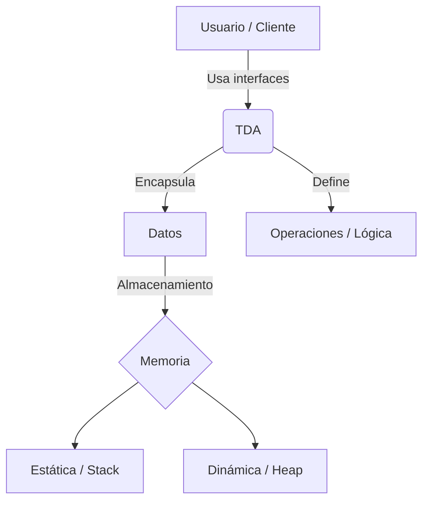

# 📚 Unidad 1: Tipos de Datos Abstractos (TDA) y Gestión de Memoria

## 📖 1. Fundamentos Teóricos

### ¿Qué es un TDA?

Un **Tipo de Dato Abstracto (TDA)** es un modelo matemático que define un tipo de datos a partir de su **comportamiento y las operaciones que permite realizar**, sin especificar cómo dichas operaciones serán implementadas internamente.

En otras palabras, un TDA describe **qué se puede hacer con los datos**, pero no necesariamente **cómo se almacenan o cómo funcionan internamente**.

Por ejemplo, una **pila (Stack)** puede definir operaciones como:

* `apilar()` → agregar un elemento.
* `desapilar()` → eliminar el elemento superior.
* `cima()` → consultar el elemento superior.
* `esta_vacia()` → comprobar si la pila está vacía.

El usuario del TDA solamente necesita conocer estas operaciones y su comportamiento. La forma en que se almacenan los elementos puede variar.

---

### 🔐 Abstracción y encapsulamiento

Los TDA se relacionan directamente con dos conceptos importantes:

**Abstracción:** permite trabajar con las características esenciales de una estructura sin preocuparse por los detalles internos de su implementación.

**Encapsulamiento:** consiste en ocultar los detalles internos de los datos y controlar el acceso a ellos mediante las operaciones definidas por el TDA.

Esto permite que el código que utiliza un TDA sea independiente de su implementación.

Por ejemplo, una misma **Pila** podría implementarse mediante:

```text
        TDA Pila
           │
     ┌─────┴─────┐
     │           │
PilaArray    PilaLista
```

Ambas implementaciones pueden ofrecer las mismas operaciones al usuario, aunque internamente utilicen mecanismos diferentes.

---

## 🧠 2. TDA vs. Estructura de Datos

Es importante diferenciar ambos conceptos:

| Concepto                | Descripción                                                                           |
| ----------------------- | ------------------------------------------------------------------------------------- |
| **TDA**                 | Define el comportamiento y las operaciones disponibles.                               |
| **Estructura de datos** | Define cómo se organizan y almacenan los datos.                                       |
| **Implementación**      | Es la forma concreta en que se construye el TDA mediante un lenguaje de programación. |

Por ejemplo, **Pila** es el concepto abstracto, mientras que una pila implementada utilizando un **arreglo** o una **lista enlazada** representa diferentes formas de implementar ese concepto.

---

# 💾 3. Gestión de Memoria

Para comprender cómo funcionan las estructuras de datos es necesario conocer, de manera general, cómo se gestionan los datos en memoria.

La memoria utilizada por un programa puede organizarse en diferentes áreas. Entre las más importantes para este tema se encuentran el **Stack** y el **Heap**.

### 📌 Stack (Pila de ejecución)

El **Stack** es una zona de memoria utilizada principalmente para almacenar información asociada a la ejecución de funciones.

Entre sus características se encuentran:

* Gestión automática de la memoria.
* Acceso rápido.
* Almacenamiento de variables locales y datos relacionados con llamadas a funciones.
* Su tamaño disponible es limitado.
* Sigue una organización **LIFO** (*Last In, First Out*).

> ⚠️ El Stack de memoria no debe confundirse con el **TDA Pila**. Aunque ambos utilizan el concepto LIFO, son conceptos diferentes.

### 📌 Heap (Montículo)

El **Heap** es una zona de memoria utilizada para la **asignación dinámica**.

Permite reservar memoria durante la ejecución del programa, por lo que resulta especialmente importante para las estructuras de datos dinámicas.

Sus características principales son:

* Asignación dinámica de memoria.
* Permite crear estructuras cuyo tamaño puede variar durante la ejecución.
* Es utilizado por estructuras como listas enlazadas, árboles y otras estructuras dinámicas.
* La gestión de la memoria depende del lenguaje y su mecanismo de administración.

En Python, por ejemplo, la gestión de memoria es realizada automáticamente por el lenguaje, incluyendo mecanismos como el **recolector de basura (Garbage Collector)**.

---

## 🔄 4. Representación de los Datos

Los datos pueden representarse y gestionarse de diferentes maneras dependiendo de las necesidades del programa.

### 📦 Representación estática

En una representación estática, el espacio de memoria se determina previamente y generalmente no cambia durante la ejecución.

Un ejemplo conceptual sería un arreglo de tamaño fijo:

```python
numeros = [10, 20, 30, 40, 50]
```

### 🔗 Representación dinámica

En una representación dinámica, la estructura puede crecer o disminuir durante la ejecución del programa.

Por ejemplo, una lista puede agregar o eliminar elementos según las necesidades del programa:

```python
numeros = []

numeros.append(10)
numeros.append(20)
numeros.append(30)
```

Esto permite trabajar con estructuras cuyo tamaño no tiene que conocerse completamente desde el inicio.

---

# 🧩 5. Esquema Conceptual

El siguiente esquema representa la relación entre el usuario, el TDA, sus datos y la memoria:



---

# 🎯 6. Importancia de los TDA

Los Tipos de Datos Abstractos permiten diseñar programas de una manera más **modular, organizada y mantenible**.

Entre sus principales ventajas se encuentran:

* **Abstracción:** ocultan los detalles innecesarios de implementación.
* **Encapsulamiento:** protegen y controlan el acceso a los datos.
* **Reutilización:** una misma interfaz puede tener diferentes implementaciones.
* **Mantenimiento:** permite modificar la implementación interna sin cambiar el código cliente.
* **Flexibilidad:** facilita utilizar diferentes estructuras de datos según las necesidades del problema.

Por ejemplo, si un programa trabaja con una interfaz `ADTPila`, el código cliente puede utilizar una implementación basada en un arreglo o una lista sin necesidad de modificar la lógica que utiliza las operaciones de la pila.

---

# 📝 7. Resumen

Un **Tipo de Dato Abstracto (TDA)** define el comportamiento de una estructura mediante un conjunto de operaciones, sin depender de una implementación específica.

La **abstracción** permite trabajar con el comportamiento de los datos, mientras que el **encapsulamiento** permite ocultar los detalles internos de su implementación.

Por otro lado, comprender la diferencia entre **Stack y Heap** ayuda a entender cómo se gestionan los datos en memoria y por qué algunas estructuras pueden tener un comportamiento estático o dinámico.

En esta unidad, estos conceptos servirán como base para estudiar e implementar diferentes estructuras de datos, comenzando por los **TDA de Pila** y sus distintas implementaciones.
